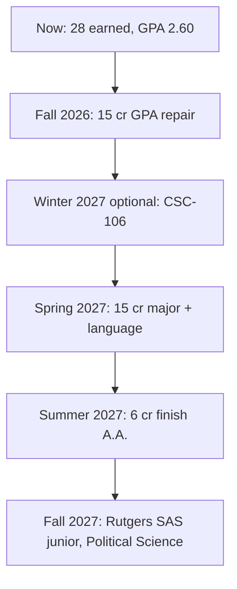

# Middlesex College → Rutgers–New Brunswick
## Political Science transfer plan (Fall 2026–Summer 2027)

Built from your first-year grades, the Middlesex 2025–2026 Political Science A.A. sheet, live Fall 2026 sections (checked August 27, 2026), NJ Transfer equivalencies into Rutgers School of Arts and Sciences, Rutgers Political Science major rules, and instructor ratings.

**Register this week.** Fall 2026 starts **September 8, 2026**. You can still add classes through Self-Service before the term starts. 100% refund through **September 7**.

Self-Service: [Search for Classes](https://middlesexcollege-ss.colleague.elluciancloud.com/Student/Courses)

---

## 1. Where you stand right now

Middlesex uses **B+ = 3.5**. Recalculated from the grade screenshots:

| Term | Credits attempted | Term GPA | Notes |
|---|---|---|---|
| Fall 2025 | 12 | 2.750 | D in POS-220 |
| Spring 2026 | 9 | 2.567 | Light load; C, C, A− |
| Summer II 2026 | 10 | 2.450 | F in PSY-123 |
| **Cumulative** | **31** | **2.600** | **28 credits earned** |

### Course audit

| Course | Grade | MCC A.A. | Rutgers SAS (C or better required) |
|---|---|---|---|
| ENG-121 English Comp I | B+ | Done | Transfers as 01:355:100 Basic Composition |
| ENG-122 English Comp II | C | Done | Transfers as **01:355:101 College Writing** |
| ENG-235 Creative Writing I | C | Counts as exploratory elective | 01:351:211 Creative Writing (AHp) |
| HIS-131 World History I | B+ | Need HIS-132 to finish the sequence | **01:506:101** World History I (Historical Analysis) |
| PHI-122 Logic and Critical Thinking | B | Philosophy requirement done | **01:730:101** Logic, Reasoning, and Persuasion (AHo) |
| POS-220 U.S. National Government | **D** | On transcript, but **retake** | **Does not transfer.** Must earn C or better for **01:790:104 American Government** |
| MAT-123 Statistics I | A− | Math 1 done | 01:960:211 (keep; do **not** take MAT-116 later) |
| BIO-131 Human Structure and Function | B+ | Lab science done (4 cr) | Elective credit only — **not** Rutgers Natural Science |
| SPE-121 Public Speaking | B+ | Speech done | 04:192:220 |
| PSY-123 Intro Psychology | **F** | Failed | Retake. Maps to **01:830:101** General Psychology if C+ |

**Transferable credits today (C or better): 25.** POS-220 D and PSY-123 F do not move to Rutgers.

### Pattern that matters

Several midterms were F and later recovered. Fall should be **15 credits, in-person, full-term**, not online PSY and not a 7-week crush. You already failed PSY-123 in an online summer section (`INE4`). Do not repeat that format.

---

## 2. GPA math (this is the whole game)

| Target | Why it matters |
|---|---|
| **2.8 + A.A.** | Middlesex–Rutgers **Dual Admission** guarantee into most New Brunswick programs, including SAS Political Science |
| **3.0+** | Rutgers’ published transfer guideline; also “no D/F in the last 12–15 credits” and last term GPA **≥ 2.7** |
| **3.3–3.8** | Middle 50% of admitted SAS transfers. Not required, but this is the competitive band |

Middlesex **replaces** the old grade with the higher repeat in your MCC GPA. Rutgers still requires C or better on the attempt that transfers.

If Fall 2026 is: retake POS-220, retake PSY-123, plus POS-121, HIS-132, SOC-121:

| If every Fall grade is | Cumulative GPA after Fall |
|---|---|
| All B (3.0) | **~3.07** |
| All B+ (3.5) | **~3.25** |
| All A− (3.7) | **~3.33** |

**Floor: B in every class. Target: B+ or A−.** That gets you over Dual Admit 2.8 *and* the 3.0 transfer guideline before you even apply.

Do **not** take 18 credits this fall. A 15-credit B+ semester beats an 18-credit mixed C semester.

---

## 3. What Rutgers Political Science actually wants

Major: 13 courses / 39 credits, **C or better in each**. At most **12 credits (4 courses)** from outside Rutgers–New Brunswick count toward the major.

NJ Transfer (Middlesex → Rutgers SAS, checked August 27, 2026):

| Middlesex course | Rutgers equivalent | Counts toward 790 major? |
|---|---|---|
| **POS-220** | **01:790:104 American Government** | **Yes — this is why you retake it** |
| **POS-222** Comparative Government | **01:790:103 Comparative Politics** (also HST + SCL) | **Yes — take in Spring if offered** |
| **POS-223** International Relations | **01:790:102 Intro to International Relations** (SCL) | **Yes — take in Spring if offered** |
| POS-121 Intro Govt & Politics | Elective credit only | No. Still **required for the MCC A.A.** |
| POS-201 State & Local Govt | American Studies elective | No for 790. OK as an MCC 200-level if 222/223 are closed |
| POS-231 Constitutional Law | Criminal Justice elective; **cannot be used for the poli sci major** | No. Skip unless you need a last-resort MCC elective |

**01:790:101 Nature of Politics has no Middlesex equivalent.** You will take it at Rutgers. That is normal.

Recommended transfer-program cognates (pick 2 of: anthropology, economics, history, philosophy, religion, sociology). You already have history and philosophy. Add **SOC-121** and, later, **ECO-201**.

After an A.A. from a New Jersey community college, Rutgers generally takes **60 credits** and treats most gen ed as done. **Exception: Contemporary Challenges (CCD/CCO) must be taken at Rutgers.** Completing the A.A. also covers the BIO-131 problem (it does not map as Natural Science on its own).

Rutgers SAS also requires a **minor**. You do not need to pick it yet; history, philosophy, economics, and sociology are all opened by courses you will already take.

---

## 4. Register these 5 classes for Fall 2026 (15 credits)

Live seat counts from Self-Service on August 27, 2026. Seats move — register immediately and have backups.

### Primary schedule (no time conflicts)

| # | Section | Instructor | Time | Campus | Why this one |
|---|---|---|---|---|---|
| 1 | **POS-220-01** U.S. National Government | Bell, L | MW **2:00–3:20** | Crabiel 204 | **Retake the D.** 15 seats open. Archer’s online section is **full**. |
| 2 | **POS-121-F2** Intro Govt & Politics | Dalina, K | M **6:00–9:25** (starts **9/28**) | Crabiel 212 | Required for the A.A. Only POS-121 section still open (9 seats). Archer’s two day sections are **full**. |
| 3 | **PSY-123-13** Intro Psychology | Ringler, N | MW **12:30–1:50** | Crabiel 218 | **Retake the F**, in person, full term. Sits right before POS-220. Do **not** take online PSY again. |
| 4 | **HIS-132-63** World History II | Margotta, J | W **6:00–8:45** | Main 133 | Finishes the HIS-131/132 sequence. Morning HIS-132 sections are **full**. 13 seats. |
| 5 | **SOC-121-03** Intro Sociology | Dzurisin III, A | T/Th **9:30–10:50** | Main 116 | Required for the A.A. Maps to **01:920:101**. Avoid Irwin Kantor (poor recent ratings). |

Weekly shape:

- **Mon:** PSY 12:30 → POS-220 2:00 → POS-121 6:00 (after 9/28)
- **Tue:** SOC 9:30
- **Wed:** PSY 12:30 → POS-220 2:00 → HIS-132 6:00
- **Thu:** SOC 9:30

### Do this today for a better POS-121 professor

**Nicholas Archer** is the strongest Political Science instructor on the Edison campus (Rate My Professors **4.6/5**, 86% would take again, difficulty 1.7). His Fall 2026 sections:

- POS-121-01 MW 12:30–1:50 — **FULL**
- POS-121-02 T/Th 11:00–12:20 — **FULL**
- POS-220-IN1 online — **FULL**

Closed sections can be overloaded with **instructor + department chair** signatures on an Add/Drop form (Enrollment Services, West Hall). Email:

- Archer (ask to overload **POS-121-02**)
- History & Social Sciences: **HSS@middlesexcc.edu**, Giuseppe Rotolo, 732.906.2590

If you get POS-121-02, **drop POS-121-F2**. Keep the rest of the schedule.

### Hard backups if a primary section closes

| If this fills | Take this instead |
|---|---|
| POS-220-01 | **POS-220-02** Bell, L, MW 11:00–12:20 (24 seats). Then move PSY to **PSY-123-22** Pereira, MW 3:30–4:50 |
| POS-121-F2 | Overload Archer POS-121-02, or POS-220-F2 is a different course — do **not** skip POS-121 |
| HIS-132-63 | **HIS-132-F2** Young, H, T 5:00–8:10 starting 9/28 (11 seats) |
| PSY-123-13 | **PSY-123-26** Perovich, J, T/Th 11:00–12:20 or **PSY-123-36** Grimaldi, F 11:00–1:45. Skip Resenhoeft (recent PSY-123 ratings are poor) and skip online |
| SOC-121-03 | **SOC-121-14** Hernandez, P, MW 9:30–10:50. Do **not** take Kantor |

**POS-231 Constitutional Law is full and does not count toward the Rutgers major anyway. Do not chase it.**

**POS-201** (Archer or Wilson) is open and easy, but it does **not** map to a 790 major course. Save your 200-level POS slots for **POS-222 and POS-223 in the spring**.

---

## 5. Active path through the A.A. (60 credits)

You have **28 earned** MCC credits (POS-220 D still counts at Middlesex). You need **32 more**. Repeating POS-220 does **not** add new credits. Repeating PSY-123 **does** (the F earned none).

### Fall 2026 — 15 credits (register now)

POS-220 retake, POS-121, PSY-123 retake, HIS-132, SOC-121.

Projected earned credits after Fall: **~40**. Projected GPA if B+: **~3.25**.

### Winter 2027 — optional 3 credits

**CSC-106** Intermediate PC Applications (not CSC-105).

- MCC technology requirement: CSC-105 **or** CSC-106
- NJ Transfer: CSC-105 is leftover elective; **CSC-106 = 01:198:110 + Quantitative Reasoning**
- Must be at least **5 weeks** for Rutgers to take a CS course

### Spring 2027 — 15 credits (apply to Rutgers this term)

| Course | Role |
|---|---|
| **POS-222 Comparative Government** | MCC 200-level #1 **and** Rutgers **790:103** |
| **POS-223 International Relations** | MCC 200-level #2 **and** Rutgers **790:102** |
| **SPA / FRE / ITA 121** (or 221 if you place up) | Language 1 of 2 |
| **MAT-124 Statistics II** | Second GE math. **Never MAT-116** — NJ Transfer says **not transferable** |
| **SOC-205** Race and Ethnic Relations **or HIS-260** Holocaust | GE Diversity. SOC-205 → 01:920:108; HIS-260 → 01:510:261 |

If POS-222 and POS-223 are both listed in Spring, take **both**. They were **not offered Fall 2026**. If only one runs, take that one plus **POS-201** with Archer or Wilson (MCC 200-level; Rutgers American Studies elective).

**Language warning (NJ Transfer footnote 58):** if you had **two or more years of high school Spanish**, Rutgers will **not** award credit for SPA-121/122. Take the Middlesex placement test. Place into SPA-221, or start **French or Italian** instead.

### Summer 2027 — 6 credits, graduate A.A.

| Course | Role |
|---|---|
| Language II (SPA/FRE/ITA 122 or 222) | Finish the two-course sequence |
| **ECO-201** Principles of Economics I | MCC social-science choice; Rutgers **01:220:103** Macro. Full term / 5+ weeks |

Skip PSY-123 in this slot — you will already have replaced the F.

Then you are at **~61 credits**, A.A. complete, GPA on a 3.2+ track if Fall/Spring stay at B+.

---

## 6. What **not** to take

| Course | Why not |
|---|---|
| MAT-116 College Algebra | **Not transferable** to Rutgers SAS |
| CSC-105 | Barely transfers; CSC-106 is the same MCC box with real Rutgers value |
| POS-231 for Rutgers major credit | Explicitly **cannot** count toward the 790 major |
| Another online PSY | You already failed that format |
| 7-week PSY/SOC/MAT as your only attempt | You recover slowly; full term is safer. Also: psych/econ/English sessions under 4 weeks, and math/CS under 5 weeks, **do not transfer** |
| Extra POS beyond 220 + 222 + 223 | Rutgers only counts 12 outside credits toward the major. POS-121 is already just elective |
| 18 credits in Fall 2026 | GPA repair first |

---

## 7. Professor scan (Fall 2026 Political Science)

| Instructor | RMP / notes | Fall 2026 | Verdict |
|---|---|---|---|
| **Nicholas Archer** | **4.6/5**, 86% take again, 1.7 difficulty. Straightforward takeaways; answers email | POS-121 full; POS-201 open; POS-220 online **full** | **Get him if you can overload** |
| **Latoya Wilson** | **4.8/5**, 100% take again | POS-201 in-person and hybrid CEL | Excellent if you need POS-201 |
| Jeffrey Ignatowitz | 4.4/5 | Not on the Fall POS grid we pulled | Strong for POS-231 if it reappears in Spring; still not a Rutgers major course |
| Payne, P | No solid public rating | POS-231 **full** | Skip; course doesn’t help 790 anyway |
| Bell, L | No Middlesex RMP page | POS-220-01 and 02 **open** | Best available POS-220 instructor with seats |
| Dalina, K | No public rating | Evening POS-121-F2 and POS-220-F2 | Use for POS-121 only if Archer stays closed |

SOC: prefer **Dzurisin** or **Hernandez**. Avoid **Irwin Kantor**.

PSY: prefer **Ringler** (in-person, schedule fit) or **Perovich**. Avoid **Resenhoeft** for PSY-123 (recent 1/5 reviews, heavy/unclear grading). Avoid repeating an online instructor/format.

---

## 8. Rutgers application timeline

| When | Action |
|---|---|
| **This week** | Register Fall 2026. Ask Archer/chair to overload POS-121-02. Confirm Dual Admission status with MCC Transfer Services |
| Fall 2026 | 15 credits, B+ floor. Use tutoring in West Hall **before** midterms (you have a slow-start pattern) |
| Oct 2026 | If Dual Admit, watch for Rutgers portal instructions |
| **Feb 1, 2027** | Apply to **Rutgers–New Brunswick, School of Arts and Sciences**, major Political Science. Dual Admit fee is waived |
| Spring 2027 | Last MCC semester. Send official transcript when spring grades post |
| May–Aug 2027 | Finish summer A.A. courses if needed. Send final transcript with degree posted |
| Fall 2027 | Enter as a junior. Take **01:790:101 Nature of Politics**, one more 100-level if needed, then 300-level distribution + research methods. Plan a minor |

If you are **not** already in Dual Admission, still finish the A.A. Regular transfer is the same coursework; the GPA bar is just a bit more competitive (aim 3.2+, not just 2.8).

---

## 9. After you land at Rutgers (so the MCC work is not wasted)

You should arrive with these 790-applicable courses **if grades are C or better**:

1. 790:104 American Government (POS-220 retake)
2. 790:103 Comparative Politics (POS-222)
3. 790:102 International Relations (POS-223)

Then at Rutgers:

- 790:101 Nature of Politics (declare the major once you have two 100-levels averaging C)
- One research methods course (790:300 / 307 / 391 / 392)
- One 300/400 in political theory, one in American, one in IR/comparative
- 790:395 seminar
- Remaining electives (12 of 15 elective credits must be 300/400)

Do **not** load extra community-college POS after those three equivalents. The 12-credit cap is real.

---

## 10. People to talk to this week

- **MCC Academic Advising / Transfer Services**, West Hall, Student Success Center
- **History & Social Sciences:** Giuseppe Rotolo, **HSS@middlesexcc.edu**, 732.906.2590
- **Enrollment Services** (overloads, Add/Drop): 732.906.4240, West Hall
- Confirm every pick in [NJ Transfer](https://njtransfer.org/) (Middlesex College → Rutgers–School of Arts and Sciences) before you substitute a course

This plan is advising, not an official degree audit. Middlesex can require a specific catalog year; if your program year differs, have an advisor check the same course list against your Student Planning audit.

---

### Sources

- Middlesex College catalog 2025–2026, Liberal Arts – Political Science A.A.
- Live Fall 2026 sections: Middlesex Self-Service, August 27, 2026
- NJ Transfer course equivalencies, Middlesex → Rutgers SAS, August 27, 2026
- NJ Transfer recommended transfer program: Political Science – BA (updated February 19, 2026)
- Rutgers Political Science major (39 credits; max 12 non-RU-NB credits)
- Rutgers Dual Admission with Middlesex: 2.8 GPA + A.A.
- Rutgers transfer guidelines: 3.0+ GPA; C or better for credit; no recent D/F
- Rate My Professors: Archer 4.6, Wilson 4.8, Ignatowitz 4.4, Resenhoeft 3.6 (recent PSY-123 reviews poor), Kantor (avoid)
